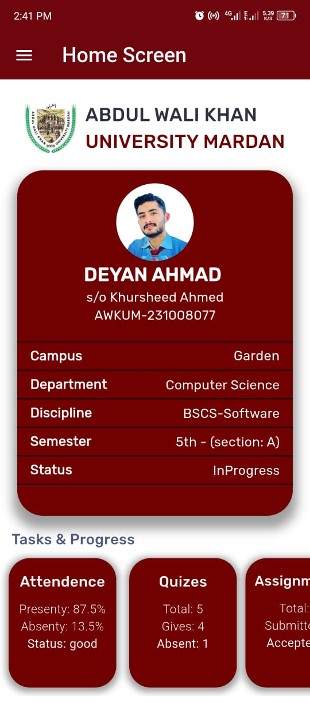
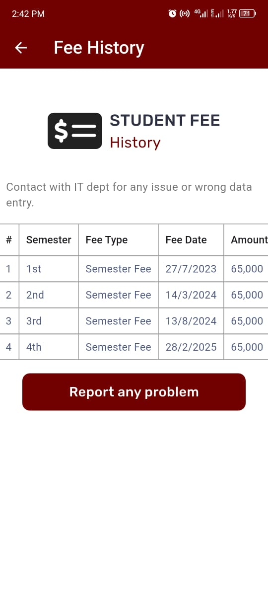
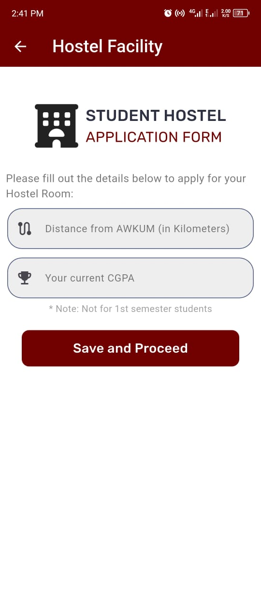
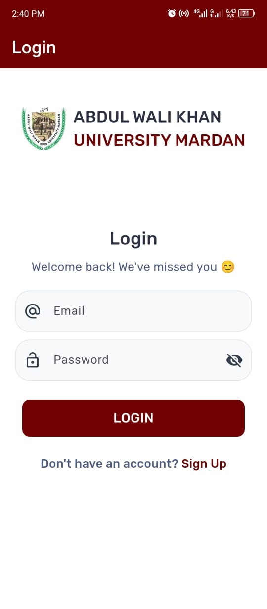
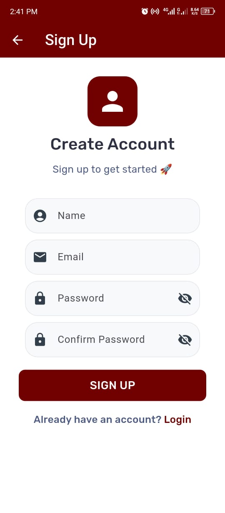
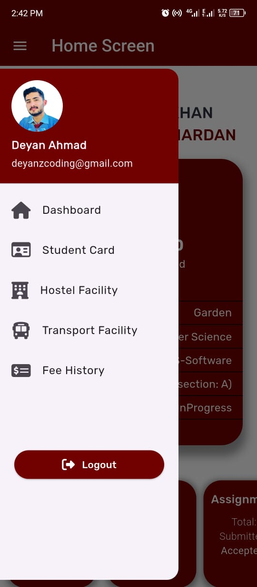
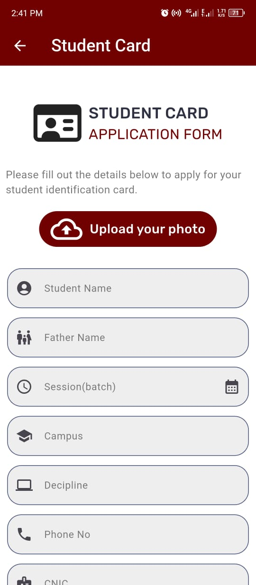
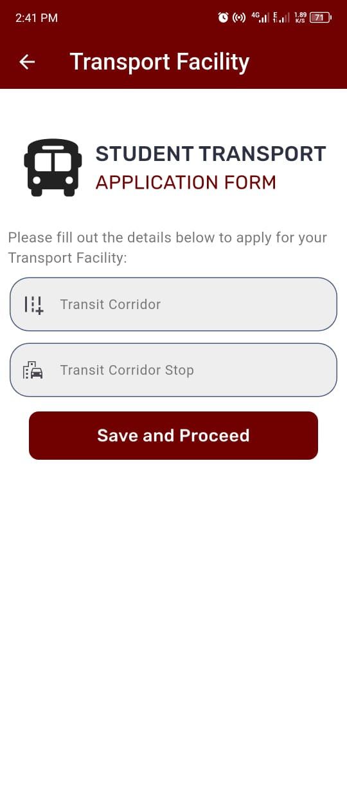

# Student Portal App (Abdul Wali Khan University LMS)

A Flutter-based mobile application designed as a student portal for managing academic and university-related information. 
This app includes a home dashboard, Identiy Card Apply, Transport Apply, Hostel Apply and features like
student profiles, progress summaries, quick actions, and upcoming deadlines.

## Table of Contents
- [Features](#features)
- [Screenshots](#screenshots)
- [Installation](#installation)
- [Project Structure](#project-structure)
- [Dependencies](#dependencies)
- [Contact](#contact)

## Features
- **Student Dashboard**: Displays student details (e.g., name, ID, campus) and progress metrics.
- **Bottom Navigation**: Showcase the academic records Attendance, Quiz, Assignments.
- **Upcoming Deadlines**: View a carousel of upcoming assignment and exam deadlines.
- **Drawer Menu**: Access additional features like Student Card, Hostel Facility, Transport Facility, Fee History, and Logout.
- **Responsive Design**: Optimized for mobile devices with a modern, attractive UI.

## Screenshots
*(Add screenshots of the app here after running it. Example:)*










## Installation

### Prerequisites
- [Flutter SDK](https://flutter.dev/docs/get-started/install) installed (version 3.x recommended).
- [Dart](https://dart.dev/get-dart) installed.
- An IDE like [Visual Studio Code](https://code.visualstudio.com/) or [Android Studio](https://developer.android.com/studio) with Flutter plugin.
- Android Emulator or iOS Simulator (or a physical device).

### Steps
1. **Clone the Repository**
   ```bash
   git clone https://github.com/your-username/student-portal-app.git
   cd student-portal-app
   


## Project Structure
student-portal-app/
├── android/          # Android configuration
├── ios/              # iOS configuration
├── lib/              # Flutter source code
│   ├── Drawer/       # Drawer-related screens (e.g., student_card.dart)
│   ├── widgets/      # Custom widgets (e.g., app_colors.dart)
│   ├── main.dart     # Entry point of the app
│   └── login_screen.dart # Login screen
├── assets/           # Image assets
│   └── images/
│       ├── logo.png
│       └── deyan_white.png
├── pubspec.yaml      # Project configuration and dependencies
└── README.md         # This file


## Dependencies
   dependencies:
   flutter:
   sdk: flutter

  -  cupertino_icons: ^1.0.8
  -  shared_preferences: ^2.5.3
  -  font_awesome_flutter: 10.9.1
  -  intl: ^0.20.2

##Conta


### Notes for Customization
1. **Screenshots**: Replace the placeholder screenshot links with actual images. Create a `screenshots` folder and add images after running the app.
2. **Repository URL**: Update the `git clone` URL with your GitHub repository link.
3. **Author Details**: Replace `Deyan Ahmad`, `deyanzcoding@gmail.com`, and `[https://github.com/deyanzcoding]` with your personal information.
4. **License**: If you don’t have a `LICENSE` file, create one or remove the License section.
5. **Dependencies**: Verify the versions in `pubspec.yaml` and update them if necessary.